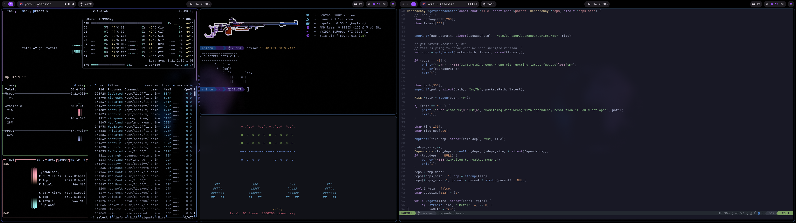

# Glaciera Dots V4

My dotfiles I use for my Gentoo Linux system

## Programs
- Window manager - Hyprland
- Bar - Vibepanel
- Text/Code editor - Neovim
- Terminal - Foot
- Resource monitor - Btop
- Wallpaper daemon - Awww
- Application launcher - Ulauncher
- Nofication daemon - Vibepanel
- Audio visualizer - Vibepanel + Cava
- Shell prompt - Starship
- Sys Info - Fastfetch
- Misc:
  - asciiquarium
  - ninvaders
  - Pavucontrol
  - Portage

## Demo

[Watch the demo](https://youtu.be/EIKYxF8IQ_A)

---

> [!WARNING]
> Glaciera Dots v1-3 are now deprecated meaning I will not be making any future updates to it.
